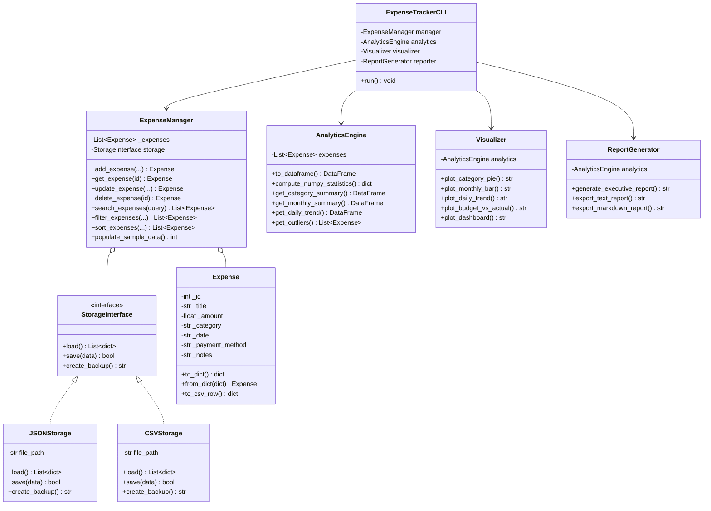

# 💰 Smart Personal Expense Tracker & Financial Analyzer

[](https://www.python.org/downloads/)
[](https://numpy.org/)
[](https://pandas.pydata.org/)
[](https://matplotlib.org/)
[]()
[]()

> A production-grade, object-oriented financial management system and data analytics suite written in Python. Goes far beyond basic CRUD to provide deep statistical analytics, time-series aggregation, budget health tracking, and publication-ready financial visualizations.

---

## 🌟 Table of Contents
1. [Overview & Highlights](#-overview--highlights)
2. [Skills Demonstrated](#-skills-demonstrated)
3. [System Architecture](#-system-architecture)
4. [Directory Structure](#-directory-structure)
5. [Key Features](#-key-features)
6. [Getting Started (VS Code & Terminal)](#-getting-started)
7. [Running Tests](#-running-tests)
8. [Analytics & Visualization Showcase](#-analytics--visualization-showcase)
9. [Interview & Viva Talking Points](#-interview--viva-talking-points)

---

## 🎯 Overview & Highlights

Many expense tracker projects are limited to simple console inputs and basic math. **Smart Personal Expense Tracker & Financial Analyzer** is engineered with clean software architecture principles:
- **Object-Oriented Design (OOP)**: Clean encapsulation with properties, custom validation, and the Dependency Inversion Principle with `StorageInterface`.
- **High-Performance Math (NumPy)**: Fast vectorized computations for total, mean, median, standard deviation, variance, and IQR percentiles.
- **Data Engineering (Pandas)**: Multi-dimensional `DataFrame` transformations, monthly time-series grouping, category share percentages, and payment distribution.
- **Data Visualization (Matplotlib)**: Automated rendering of Donut Charts, Monthly Bar Charts, Daily Cumulative Trendlines, and 4-Panel Executive Dashboards.
- **Resilient Persistence**: Atomic JSON file writing with temporary swap files, automatic timestamped backup creation, and CSV import/export.
- **Automated Reporting**: Multi-format exports into formatted Plain Text (`.txt`), GitHub-flavored Markdown (`.md`), and raw spreadsheet data (`.csv`).

---

## 🚀 Skills Demonstrated

| Technical Domain | Features Implemented |
| :--- | :--- |
| **Core Python** | Flow control, List Comprehensions, Match/Case logic, Type Hints |
| **Object-Oriented Programming (OOP)** | Classes, Encapsulation (`@property`), Inheritance, Polymorphism, Magic Methods (`__eq__`, `__lt__`, `__repr__`) |
| **Interface Abstraction** | Abstract Base Classes (`abc.ABC`, `@abstractmethod`) for pluggable persistence |
| **Exception Handling** | Custom domain exception hierarchy (`ExpenseTrackerError`, `ValidationError`, `ExpenseNotFoundError`) |
| **File Handling & Serialization** | Atomic JSON writes, CSV `DictReader`/`DictWriter`, Timestamped backups |
| **Data Analytics (NumPy)** | Vectorized calculations for mean, median, std dev, 25th/75th/90th percentiles, IQR outlier detection |
| **Data Analytics (Pandas)** | `DataFrame` manipulation, `groupby()`, `agg()`, `rolling()` windows, `cumsum()` |
| **Visual Computing (Matplotlib)** | Custom figure layouts, twin axes, donut chart wedges, bar labels, PNG export |
| **Testing (PyTest)** | 25 comprehensive automated unit tests covering models, storage, managers, and analytics |
| **CLI & User Experience** | ANSI color-coded interactive menu, tabular ASCII renderers, robust prompt loops |

---

## 🏛️ System Architecture



---

## 📂 Directory Structure

```
smart_expense_tracker/
├── charts/                     # Generated visual charts (.png)
│   ├── category_pie.png
│   ├── monthly_trend.png
│   ├── daily_trend.png
│   ├── budget_vs_actual.png
│   └── master_dashboard.png
├── data/                       # Data persistence directory
│   ├── expenses.json           # Primary JSON database
│   ├── expenses.csv            # Exported CSV dataset
│   └── backups/                # Automatic timestamped backups
├── reports/                    # Generated financial reports
│   ├── financial_report.txt    # ASCII tabular executive report
│   └── financial_report.md     # Markdown financial report
├── src/                        # Application source package
│   ├── __init__.py
│   ├── models/                 # Domain Entities & Value Objects
│   │   ├── __init__.py
│   │   ├── expense.py          # Core Expense model with encapsulation
│   │   ├── category.py         # Category metadata & styling
│   │   └── budget.py           # Monthly budget targets & status evaluation
│   ├── storage/                # Persistence & Data Access Layer
│   │   ├── __init__.py
│   │   ├── storage_interface.py# Abstract base storage contract (ABC)
│   │   ├── json_storage.py     # Atomic JSON file storage
│   │   └── csv_storage.py      # CSV export/import storage
│   ├── services/               # Core Business Logic
│   │   ├── __init__.py
│   │   ├── expense_manager.py  # CRUD, filtering, searching, sorting
│   │   ├── analytics_engine.py # NumPy array math & Pandas aggregations
│   │   ├── visualizer.py       # Matplotlib graphical chart rendering
│   │   └── report_generator.py # Formatted report export engine
│   ├── utils/                  # Shared Helpers
│   │   ├── __init__.py
│   │   ├── validators.py       # Custom exception hierarchy & input validators
│   │   ├── formatters.py       # Terminal ANSI colors & ASCII table builder
│   │   └── sample_data.py      # Realistic mock dataset generator
│   └── ui/                     # Presentation Layer
│       ├── __init__.py
│       └── cli_menu.py         # Interactive terminal user interface
├── tests/                      # Automated Unit Test Suite
│   ├── __init__.py
│   ├── test_expense.py         # Expense model & validation tests
│   ├── test_storage.py         # JSON and CSV storage unit tests
│   ├── test_manager.py         # ExpenseManager CRUD & query tests
│   └── test_analytics.py       # NumPy & Pandas computational tests
├── main.py                     # Primary Application Entry Point
├── requirements.txt            # Pinned dependencies
├── .gitignore                  # Git ignore rules
└── README.md                   # Project documentation
```

---

## ⚡ Key Features

### 1. Robust CRUD Operations
- **Add Expense**: Validated prompt sequence (Title, Amount, Category, Date, Payment Mode, Notes).
- **View All Expenses**: Tabular format with category emoji tags, currency formatting, and record totals.
- **Update Expense**: Interactive field-by-field updater; press `[Enter]` to retain existing values.
- **Delete Expense**: Delete with confirmation protection.

### 2. Multi-Criteria Search & Filtering
- **Keyword Search**: Substring matching across title, notes, category, and payment method.
- **Filter**: Filter by category, price bounds (`min_amount`, `max_amount`), and date spans (`start_date`, `end_date`).
- **Sorting**: Order by date, amount, category, or title (ascending / descending).

### 3. NumPy Statistical Engine
Computes key financial distribution metrics in vector space:
- **Total & Average**: Net spend and mean cost per transaction.
- **Median & Percentiles**: 25th (Q1), 50th (Median), 75th (Q3), and 90th percentiles.
- **Dispersion Metrics**: Standard Deviation, Variance, and Interquartile Range (IQR).
- **Anomaly Detection**: Flags transactions exceeding $Q3 + 1.5 \times IQR$.

### 4. Pandas Aggregation Suite
- **Category Summary**: Net spending, transaction count, average cost, and percentage share of total budget.
- **Monthly Analysis**: Time-series grouping by month with top spending category detection.
- **Payment Method Distribution**: Breakdown across UPI, Credit Card, Debit Card, Cash, and Bank Transfer.
- **Daily Trend & Moving Average**: Cumulative growth and 7-day rolling window average.

### 5. Matplotlib Visualization Suite
Generates high-resolution PNG charts:
1. `category_pie.png`: Donut chart showing category allocations.
2. `monthly_trend.png`: Bar chart of monthly spending with benchmark reference lines.
3. `daily_trend.png`: Dual-axis line and area chart of daily spikes and cumulative trajectory.
4. `budget_vs_actual.png`: Comparison chart comparing actual expenditures against set limits.
5. `master_dashboard.png`: 4-in-1 executive dashboard combining all primary charts.

---

## 💻 Getting Started

### Prerequisites
- Python 3.10 or higher
- VS Code (or any IDE / Terminal)

### Installation
1. Clone or open the project folder in VS Code:
   ```bash
   cd "python project 2026"
   ```

2. (Optional) Create and activate a virtual environment:
   ```bash
   # Windows (PowerShell)
   python -m venv venv
   .\venv\Scripts\Activate.ps1
   ```

3. Install required packages:
   ```bash
   pip install -r requirements.txt
   ```

### Running the Application
Launch the interactive CLI menu:
```bash
python main.py
```

### CLI Command Flags
You can also run batch operations without entering the interactive menu:
```bash
# Pre-populate 40 sample transactions
python main.py --sample

# Generate all visualization charts (.png) into /charts
python main.py --generate-charts

# Generate all financial reports (.txt, .md, .csv) into /reports
python main.py --generate-reports
```

---

## 🧪 Running Tests

The project includes 25 unit tests covering every major component:
```bash
pytest -v
```

Expected Output:
```
============================= test session starts =============================
collected 25 items

tests/test_analytics.py::TestAnalyticsEngine::test_numpy_statistics_calculation PASSED
tests/test_analytics.py::TestAnalyticsEngine::test_empty_analytics PASSED
tests/test_analytics.py::TestAnalyticsEngine::test_pandas_category_aggregation PASSED
tests/test_analytics.py::TestAnalyticsEngine::test_pandas_monthly_aggregation PASSED
tests/test_analytics.py::TestAnalyticsEngine::test_outlier_detection PASSED
tests/test_expense.py::TestExpenseModel::test_valid_expense_creation PASSED
tests/test_expense.py::TestExpenseModel::test_invalid_amount_raises_error PASSED
tests/test_expense.py::TestExpenseModel::test_invalid_title_raises_error PASSED
tests/test_expense.py::TestExpenseModel::test_invalid_date_raises_error PASSED
tests/test_expense.py::TestExpenseModel::test_to_dict_and_from_dict PASSED
tests/test_expense.py::TestExpenseModel::test_csv_serialization PASSED
tests/test_expense.py::TestExpenseModel::test_magic_methods PASSED
tests/test_expense.py::TestBudgetModel::test_category_budget_status PASSED
tests/test_manager.py::TestExpenseManager::test_add_and_get_expense PASSED
tests/test_manager.py::TestExpenseManager::test_get_nonexistent_expense_raises_error PASSED
tests/test_manager.py::TestExpenseManager::test_update_expense PASSED
tests/test_manager.py::TestExpenseManager::test_delete_expense PASSED
tests/test_manager.py::TestExpenseManager::test_search_expenses PASSED
tests/test_manager.py::TestExpenseManager::test_filter_expenses PASSED
tests/test_manager.py::TestExpenseManager::test_sort_expenses PASSED
tests/test_manager.py::TestExpenseManager::test_populate_sample_data PASSED
tests/test_storage.py::TestJSONStorage::test_save_and_load PASSED
tests/test_storage.py::TestJSONStorage::test_load_empty_file_returns_empty_list PASSED
tests/test_storage.py::TestJSONStorage::test_backup_creation PASSED
tests/test_storage.py::TestCSVStorage::test_csv_save_and_load PASSED

============================= 25 passed in 6.63s ==============================
```

---

## 🎤 Interview & Viva Talking Points

When presenting this project for your Python class or a technical interview, use these explanations:

### 1. How is OOP applied here?
- **Encapsulation**: In the `Expense` class, attributes like `amount`, `date`, and `title` use Python properties (`@property` and `@setter`) to validate business rules before assignment, preventing corrupted state.
- **Polymorphism & Abstraction**: We defined an abstract `StorageInterface` using Python's `abc.ABC`. Both `JSONStorage` and `CSVStorage` implement the same contract, meaning we can swap storage engines in `ExpenseManager` without touching business logic (Dependency Inversion Principle).
- **Magic Methods**: Implemented `__eq__` (equality by ID), `__lt__` (sorting comparison by date and amount), `__str__` (readable table line), and `__repr__` (debugging).

### 2. Why use NumPy over standard Python lists?
- Standard Python `sum()`, `mean()`, or loops operate with dynamically-typed pointers, incurring high memory and interpretation overhead.
- NumPy arrays store contiguous C-level memory buffers and execute SIMD vectorized calculations, computing percentiles, variance, and standard deviation substantially faster on large datasets.

### 3. How does Pandas improve data analysis?
- Instead of nested dictionary iterations, Pandas allows declarative data manipulation via `groupby('category')['amount'].agg(...)`.
- We easily compute percentage share of total spending, 7-day rolling window moving averages with `.rolling(7)`, and multi-month time series pivots.

### 4. How are edge cases and errors handled?
- Custom exception hierarchy (`ExpenseTrackerError` $\rightarrow$ `ValidationError`, `ExpenseNotFoundError`, `StorageError`).
- Defensive input validation: prevents negative numbers, dates in the wrong format, non-numeric inputs, and missing required fields.
- Atomic file writes: JSON storage writes to a `.tmp` file first and executes an atomic file replace to prevent database corruption if interrupted during save.

---

## 📜 License
Developed for Academic Final Project Presentation. Distributed under the MIT License.
